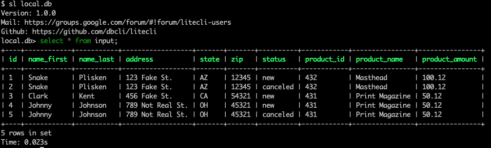

# what is this?

* hacking on an interview problem

# how to run?

* have Python 3+ installed
* create project directory and `cd` into project
* create virtual environment: `python3 -m venv venv`
* activate virtual environment: `source venv/bin/activate`
* install dependencies: `make install`
* run app: `make run`
* open web client at `http://localhost:5000`
* allowed file types for upload: `.txt`, `.csv` (you can use the `example.txt/csv` files in the repo)

# log book

* scaffold project: grab Makefile that from [my boilerplate](https://github.com/zachvalenta/create-python-app) and strip it down to bare essentials, grab another Makefile rule from [another Flask project I have going](https://github.com/zachvalenta/book-db) 
* follow Flask [docs for file upload](http://flask.pocoo.org/docs/1.0/patterns/fileuploads/), work through error by adding last function from docs `uploaded_file`
* use python-dotenv to load `.env` to use Flask message flashing, extract template from view
* hack together under-normalized model, everything still runs
* hard-code some data to make sure model correct
* parse csv
* write csv; foot shotgun w/ typo (forgot `row` in `product_id=row[7]`, ended up wasting 20 mins in SQLAlchemy docs and on StackOverflow looking up info on Alchemy type system)
* run out of time

# next steps

so many :) so I'll keep it brief

* sanitization: bring in WTForms and sanitize before writing, although Stack Overflow says [SQL injection is mitigated out-of-box by SQLAlchemy](https://stackoverflow.com/a/6501664) so idk
* normalization: my, ahem, db schema is one big table rn, so need to fix that up into something along the lines of `customer`, `order` at least, maybe `address` as well
